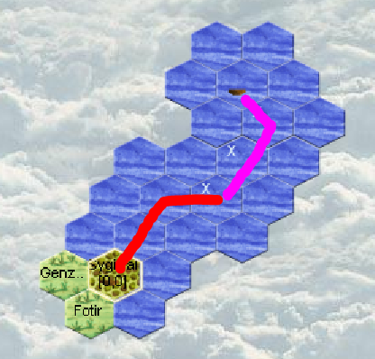
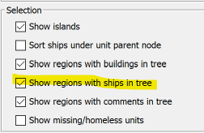

# Turn 3

No visits from potential neighbors.  
No coasts on the horizon.  
We're lucky, one mage reached level 2!  
We're lucky, one entertainer reached level 2!  
We have 270 silvers in our region.  

## Actions

- The navigator takes possession of the boat and sets off sailing. He will hug the western coast to discover a bit of our island.  
An entertainer accompanies him. He enters the boat and gives control to the captain. The order must be forced because since he's not yet in the boat theoretically he cannot give control of it.  
- The shipcrafter leaves the boat and finishes it (otherwise he would leave with it and since he has all the wood the boat wouldn't leave!)  
**Warning: to finish the boat the order is different from the one given to start it!**  

- We recruit 2 new entertainers and give the rest of the money to the captain.  
- Everyone who can brings back money.  
- The mage who reached level 2 gained 2 Aura points, so he can cast a spell at level 2. Which we do to earn 100 silvers!

## Magellan : to do for aquarian
How to configure magellan to see all ships in a region : In EXTRA/Options/Overview  
  

Now all ships can be seen easily  

  

