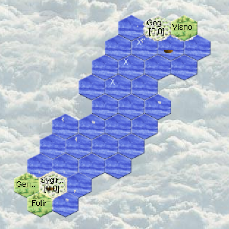

# Turn 4
--------

**We found a new island!**  

- No visits from potential neighbors.  
- Coasts on the horizon!  
- But our second boat didn't leave!  
Let's see, looking at the previous turn's orders I forgot to make the captain enter the boat! Classic mistake! We've lost a week of exploration and 110 silvers of investment.  
- Apart from that everything is going well.

## Exploration
**We found a new island!**  
Let's take advantage of having 2 entertainers on board to save time: let's make one of them **swim** to the plain of Gogan Ror. Why the plain: because it might be inhabited and we want to meet people.  
The boat will continue its exploration in coastal mode, but let's not forget to give 10 silvers to the swimmer/ambassador!
### Swimming
A unique powerful ability. An aquarian can leave a coastal ship and move to an adjacent land region. The same rules as land movement apply. For more details, consult the wiki.
https://wiki.eressea.de/Schiffsreise/en#Anschwimmen  
*However, it's impossible to go from land to water*

## Sygirfal

We have 380 silvers in our region.  
Our level 2 mage brought back 100 silvers without incident!  
Another one reached level 2!  
But 1 level 1 mage became a Toad! That means he seriously failed his spell! He no longer has skills and is gifted with "pot of toadslime".  
The boat is finished.  

## Actions

- The navigator ENTERS the boat and sails, his second gives him control of the boat (he thus becomes the owner and captain). The captain and second carry the silver  necessary for the voyage.  
We're going to hug the western coast.  
- With 2 level 2 mages and 2 level 2 entertainers we can at this stage choose to dedicate silver to something other than recruiting entertainers (even though we never have enough!)  
- So we recruit for 80*3: 240 silvers  
 - 1 forestry to make wood for new boats  
 - 1 taming to make horses  
 - 1 riding to explore the island and later for transport.  
- We start 1 new boat and train the future captain.  
- Everyone who can brings back money.  
### Mages

The new mage who reached level 2 only gained 1 Aura point, so he cannot cast a spell at level 2. The other one with 3 points can.  
The toad cannot learn. So we give him the order to work. Moreover we give his "pot of toadslime" to another unit so the mage won't be easily identifiable.  
The toad will become a mage again in a few turns.  
*Good to know: Seen from outside, other factions don't see "pot of toadslime", but a potion.*
