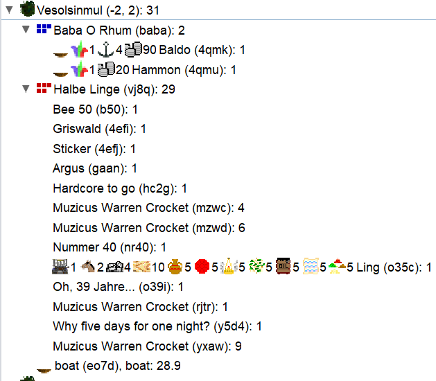

# Turn 5
--------
*Diplomatic messages are in communication*

No visits from potential neighbors.  
**Discovery of close neighbors!**  
**Meeting with a tribe from the new island!**  

## Vesolsinmul

The boat that left west directly landed on the plain of Vesolsinmul. This is the starting region of the Halbe Linge, a halfling tribe.  
This race is a real money-making machine. It would be good to befriend them otherwise we're going to be in competition.  
Sending a message to the Halbe Linge.  
They haven't cut wood yet, their forest is at 500.  
The Ling unit carries the halflings' starting allocation.  
With diplomacy being positive, we decide to continue our voyage without leaving an ambassador.  
We continue west, but be careful, a boat can only depart from the coast it landed on or those directly to the right or left.  
Since we arrived from the southeast, we must leave either by the southwest or by the east.  
The southwest being land, we leave by the east.  

## Gogan Ror

Our swimmer meets the Anbeter des Großen Baums, a human tribe. There is 1 castle at 10 (humans' basic allocation), and 2 potions.  
It's a bit early for potion making so these must be "pot of toadslime" or potions given by another tribe.  
Let's note the ID of the units with potions, they might be the mages:  
Erzdruidin Milli (ii), Erzdruide Boros (drui),  
The human has started making weapons (spear) and used their starting wood. No horses yet. Humans are those who can best compete with aquarians in navigation.  
Let's try to make them a friend or even an ally.  
Sending a message to the Anbeter des Großen Baums.  
Hannibal (4qmd) will entertain.  

## Boats

O mon Bateau!, our northeast boat, did coastal sailing and hugs the coasts of the new island.  
It will go further east and we'll try to get the island's map through diplomacy.  
We take the opportunity to rename this boat (just an idea :) ).  

## Sygirfal

We have 240 silvers.  
Jesibel (4qmf) failed her spell for 100 silvers!  
Izabel (4qme) is no longer a toad.  
Hyrum (z4v3) gained a level in perception!  

## Actions

- We need silver to send the boat to sea.  
We give Aqhat (t3zs) 90 silvers and Itthobaal (om0k) boards with 10 silvers and will entertain upon departure (+20 silvers = upkeep). Both enter the boat, Itthobaal gives control to the captain.  
We're going to leave southeast.  
Ugarit (4qmj) leaves the boat and finishes it.  
- We use 80 silvers to recruit a new entertainer and keep the rest in case things go wrong (mage fumbles).  
- We cut wood (T1 = 1 wood/week/h), tame horses (T1 = 1 horse/week/h).  
- The rider learns entertain while waiting for his horse. He will go to the Halbe Linge to strengthen ties.  

## Diplomacy

- Halbe Linge: first contact goes well and I might be able to handle trade  
- Anbeter des Großen Baums: friendly, proposes trade.
