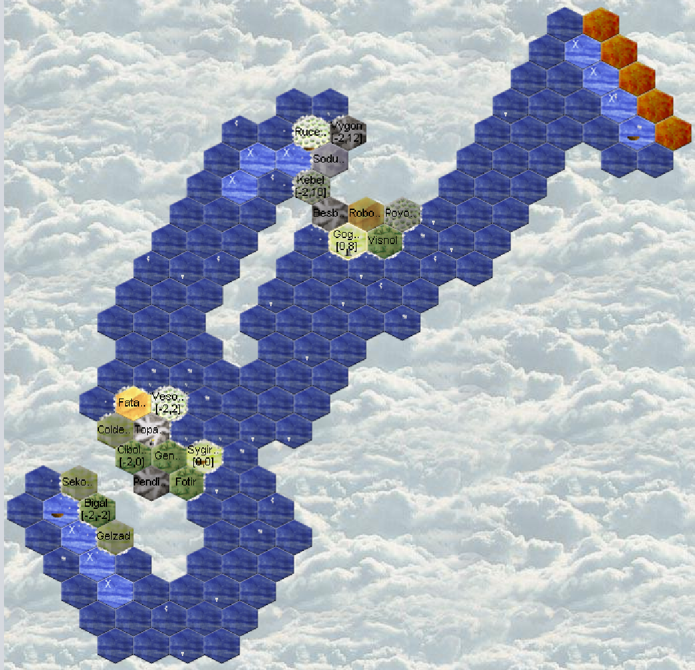

# Turn 9
--------

**Encountered a new close neighbor!**  
**Encountered 2 tribe from the new island!**  

No visits from neighbors.

## Vesolsinmul
Meeting "Schnurrender Haufen Glück", a cat tribe. This is the faction that was in copy. So here are the 3 who seem to work together.  
Halbe Linge brings out its first weapons but hasn't traded yet.  
The region is guarded so no recruitment possible.  
Hardcore to go (hc2g) has a potion, might be a mage.  
No buildings.  
Schnurrender Haufen Glück: I only see one unit, but it's a cat. Having no perception here, I don't see much.  

## Gogan Ror
Meeting a dwarf from "Odins Hammer" at the human's.

## Rucebigil
Arrival in a new faction's region, "Apostel Belars"  
The region is guarded so no recruitment possible and no entertainment from the ship.  
The human has an ambassador there (or more?).  
The Apostel Belars are only 14 visible, and with 1-person units. Could be the demon. In any case it looks like it.  
Beltira (7v3o) has a potion, mage?  

## Sygirfal
Ahirom (4qmi) reaches level 2, Nora (4qmh) who fumbles (no money earned).  
Mason level 0, need to reach T1 to start the tradepost.  
A Forestry T2!  
The boat will be finished this week and can leave. The Captain enters with an entertainer and leaves to explore the East.  
We recruit a new rider, to transport stone to make a tradepost in a swamp.  
And 10 entertainers. As I don't have much time to spend on my orders this week, I don't optimize and make a group of 10  

## Exploration
The boats explore and map the islands.  
To the north I will go to the glacier, to recover a dwarf.  
Around my island, I want to avoid landing on a region, because I risk being attacked and having my boat stolen. So I sail offshore.

## Diplomacy
- First contact with "Apostel Belars"  
- First contact with "Odins Hammer": He is attacked by the insect and accepts my rescue proposal. He sends me a map of his island.  
- Anbeter des Großen Baums: some regular exchanges to talk about this and that then the meeting. But this week he tells me about the presence of an elf and warns me against the insect living to the east.  
- With the 3 tribes on my island: I defend myself, I'm not hiding. I tell them. On their side they acknowledge their mistake and apologize. I learn that together they are the "West Coast Party". I attempt to join their alliance.  
But I must now be cautious, it might just be a ruse.