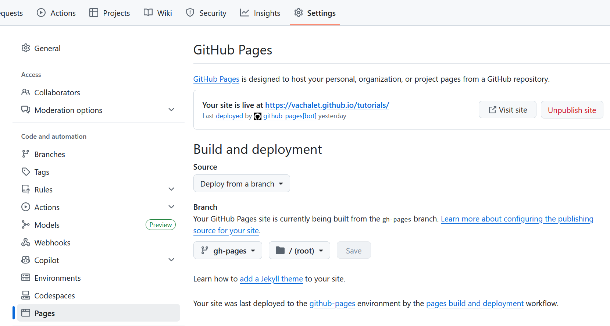

# Schnellanleitung zum Veröffentlichen Ihres „Tutorials"

## 📋 Überblick

Diese Anleitung führt Sie durch die Veröffentlichung Ihrer Spielberichte auf GitHub Pages in 4 Hauptschritten:

1. **Vorbereiten** Ihrer Markdown-Dateien
2. **Erstellen** Ihres GitHub-Forks  
3. **Hinzufügen** Ihrer Dateien
4. **Beitragen** zum Hauptprojekt

---

## SCHRITT 1: Markdown-Dateien vorbereiten

### 1.1 Ihre .md-Dateien erstellen

- Bereiten Sie Ihre Dateien im `.md` (Markdown) Format vor
- Konsultieren Sie Online-Tutorials oder verwenden Sie Konverter
- **Benennung:** Verwenden Sie Namen ohne Leerzeichen (verwenden Sie `-` oder `_`)
- **Bilder:** Vermeiden Sie Dateiendungen in Großbuchstaben

### 1.2 Den obligatorischen Header hinzufügen

**⚠️ WICHTIG:** Fügen Sie diesen Block am Anfang jeder Datei ein:

```yaml
---
title: "Your_Race: Runde 1"
date: 2023-10-15
---
```

- Das **Datum** bestimmt die Anzeigereihenfolge auf Ihrer Seite
- Ich habe das Datum der Runden-Generierung eingesetzt. (also cr oder nr)
- Für Intro/Fazit: Passen Sie das Datum für die richtige Positionierung an

### 1.3 Formatierungsregeln

- **Zeilenumbruch:** mit `Leerzeichen+Leerzeichen+Return` enden
- **Titel:** verwenden Sie `#`, `##`, `###`
- **Bilder:** Format ``

**Nützliche Ressourcen:**
- [Discord](https://discord.com/channels/509396702663278592/1193551778952781846/1404064429024346177)
- [Goblins Beispiel](https://eressea.github.io/tutorials/goblins/)

---

## SCHRITT 2: Ihren GitHub-Fork erstellen

### 2.1 Ein GitHub-Konto erstellen
Falls noch nicht geschehen: https://github.com

### 2.2 Das Repository forken

1. **Gehen Sie zu:** https://github.com/eressea/tutorials
2. **Klicken Sie auf:** „Fork"-Button (oben rechts)
3. **Wählen Sie:** Ihr persönliches Konto
4. **Warten Sie auf:** die Fork-Erstellung

### 2.3 Ihren Fork konfigurieren

**Allgemeine Konfiguration**


**GitHub Pages aktivieren**



**💡 Hinweis:** Für spätere Synchronisation → „Sync fork"-Button

**⚠️ Berühren Sie nicht den gh-pages-Branch** Er dient zur Veröffentlichung Ihrer Seiten.

---

## SCHRITT 3: Ihre Dateien hinzufügen

### 3.1 GitHub Desktop installieren

**Download:** https://desktop.github.com/download/

### 3.2 Erster Start

1. **Authentifizierung:** über Ihren Browser
2. **Klonen:** Wählen Sie Ihr Repository
3. **Klicken Sie:** „Clone your_account/tutorials"
4. **Standardordner:** `C:\Users\<IhrBenutzername>\Documents\GitHub\tutorials`

### 3.3 Ihre Dateien organisieren

- **Erstellen Sie:** einen `your_race`-Ordner neben dem `goblins`-Ordner
- **Fügen Sie hinzu:** Ihre `.md`-Dateien in diesen Ordner

### 3.4 Git-Workflow

#### Änderungen ansehen


#### Commit (speichern)
1. **Wählen Sie:** Dateien zum Committen aus
2. **Schreiben Sie:** kurze Beschreibung der Änderungen
3. **Klicken Sie:** „Commit * files to main"

#### Push (senden)


**Klicken Sie:** „Push origin" um zu GitHub zu senden

---

## SCHRITT 4: Zum Projekt beitragen

### 4.1 Ihre Arbeit überprüfen

#### ✅ Ihre Seiten testen
1. **Gehen Sie zu:** Ihrer Website (Link in Settings → GitHub Pages)
2. **Überprüfen Sie:** die Seitenanzeige
3. **Bei Problemen:** auf Ihrem PC: ändern → commit → push
4. **⏱️ Geduld:** Update kann Zeit brauchen

#### ✅ Ihren Fork synchronisieren
- **Überprüfen Sie:** ob Ihr Fork aktuell ist
- **Falls nötig:** verwenden Sie „Sync fork"

### 4.2 Eine Pull Request erstellen

#### Wenn alles bereit ist:


1. **Gehen Sie zu:** „Pull Request"
2. **Klicken Sie:** „New Pull Request"
3. **Überprüfen Sie:** alles was vorgeschlagen wird
4. **Kommentieren Sie:** erklären Sie Ihre Änderungen
5. **Bestätigen Sie:** senden Sie die Anfrage

#### 🎉 Ergebnis
Ihr Beitrag liegt nun in Ennos Händen zur Validierung!

---

## 🚀 Zusammenfassung der Schritte

| Schritt | Aktion | Tool |
|---------|--------|------|
| 1 | .md-Dateien vorbereiten | Texteditor |
| 2 | Fork + Konfiguration | GitHub Web |
| 3 | Dateien hinzufügen | GitHub Desktop |
| 4 | Pull Request | GitHub Web |

## 📞 Hilfe benötigt?

- Auf Discord: https://discord.com/channels/509396702663278592/1404841577402077332
- GitHub-Dokumentation für Git-Details
