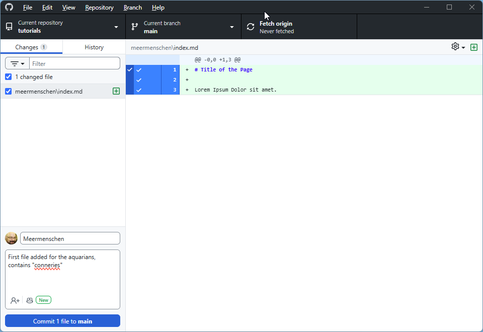

# Quick Tutorial for Publishing Your "Tutorial"

## 📋 Overview

This tutorial guides you to publish your game reports on GitHub Pages in 4 main steps:

1. **Prepare** your Markdown files
2. **Create** your GitHub fork  
3. **Add** your files
4. **Contribute** to the main project

---

## STEP 1: Prepare Markdown Files

### 1.1 Create your .md files

- Prepare your files in `.md` (Markdown) format
- Check online tutorials or use converters
- **Naming:** Use names without spaces (use `-` or `_`)
- **Images:** Avoid uppercase extensions

### 1.2 Add the mandatory header

**⚠️ IMPORTANT:** Insert this block at the beginning of each file:

```yaml
---
title: "Your_Race: Runde 1"
date: 2023-10-15
---
```

- The **date** determines the display order on your page
- Use cr date
- For intro/conclusion: adjust the date for proper positioning

### 1.3 Formatting rules

- **Line break:** end with `space+space+return`
- **Titles:** use `#`, `##`, `###`
- **Images:** format ``

**Useful resources:**
- [Discord](https://discord.com/channels/509396702663278592/1193551778952781846/1404064429024346177)
- [Goblins Example](https://eressea.github.io/tutorials/goblins/)

---

## STEP 2: Create your GitHub fork

### 2.1 Create a GitHub account
If not already done: https://github.com

### 2.2 Fork the repository

1. **Go to:** https://github.com/eressea/tutorials
2. **Click on:** "Fork" button (top right)
3. **Select:** your personal account
4. **Wait for:** fork creation

### 2.3 Configure your fork

**General Configuration**


**Enable GitHub Pages**


**💡 Note:** To synchronize later → "Sync fork" button

**⚠️ Don't touch the gh-pages branch** It serves to publish your pages.

---

## STEP 3: Add your files

### 3.1 Install GitHub Desktop

**Download:** https://desktop.github.com/download/

### 3.2 First launch

1. **Authentication:** via your browser
2. **Clone:** select your repository
3. **Click:** "Clone your_account/tutorials"
4. **Default folder:** `C:\Users\<YourUserName>\Documents\GitHub\tutorials`

### 3.3 Organize your files

- **Create:** a `your_race` folder next to the `goblins` folder
- **Add:** your `.md` files to this folder

### 3.4 Git Workflow

#### See modifications


#### Commit (save)
1. **Select:** files to commit
2. **Write:** short description of changes
3. **Click:** "Commit * files to main"

#### Push (send)


**Click:** "Push origin" to send to GitHub

---

## STEP 4: Contribute to the project

### 4.1 Verify your work

#### ✅ Test your pages
1. **Go to:** your site (link in Settings → GitHub Pages)
2. **Check:** page display
3. **If problem:** on your PC: modify → commit → push
4. **⏱️ Patience:** update may take time

#### ✅ Synchronize your fork
- **Check:** if your fork is up to date
- **If necessary:** use "Sync fork"

### 4.2 Create a Pull Request

#### When everything is ready:


1. **Go to:** "Pull Request"
2. **Click:** "New Pull Request"
3. **Review:** everything that will be proposed
4. **Comment:** explain your changes
5. **Validate:** send the request

#### 🎉 Result
Your contribution is now in Enno's hands for validation!

---

## 🚀 Steps Summary

| Step | Action | Tool |
|------|--------|------|
| 1 | Prepare .md files | Text editor |
| 2 | Fork + config | GitHub web |
| 3 | Add files | GitHub Desktop |
| 4 | Pull Request | GitHub web |

## 📞 Need help?

- On Discord: https://discord.com/channels/509396702663278592/1404841577402077332
- GitHub documentation for Git details
